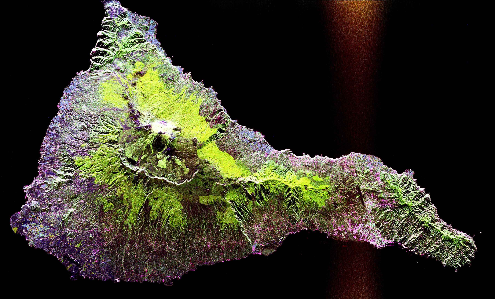

In this essay, we will talk about how to add a picture in blog.

<!--more-->

There are many ways to add a picture, the one to use pure markdown syntax is ``.

Now I will show you a BIG picture (3600x2180):

And a small picture (30x20):

Here is a inline markdown mark .

## Some other things

**Note** that due to the *big picture* is from [Wikipedia][wikipedia] who use [CC-BY-SA 3.0][cc-by-sa-3] as license, so this essay also use [CC-BY-SA 3.0] as license.

The *big picture* is from <https://en.wikipedia.org/wiki/Image>.

The small markdown mark has been dedicated to the public domain.

[wikipedia]: https://wikipedia.org/ "Wikipedia"
[cc-by-sa-3]: https://en.wikipedia.org/wiki/Wikipedia:Text_of_the_Creative_Commons_Attribution-ShareAlike_3.0_Unported_License "Creative Commons Attribution-ShareAlike License 3.0"

